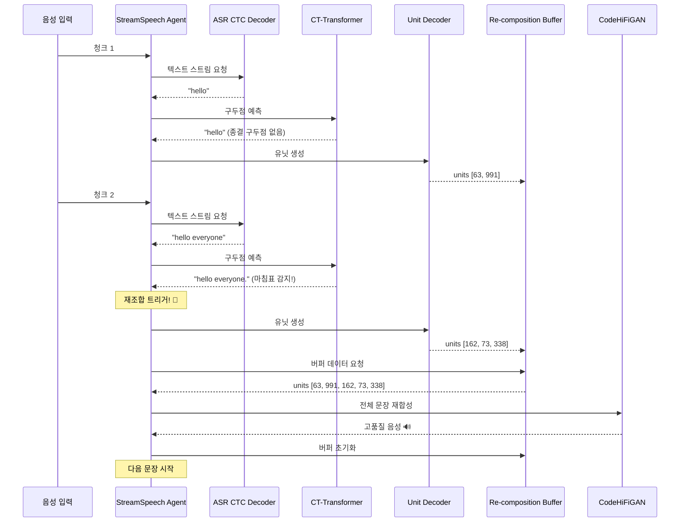

# StreamSpeech 실시간 번역 핵심 파일

StreamSpeech 저장소에서 **실시간 번역 및 CT-Transformer 통합**과 직접 관련된 핵심 파일들만 정리했습니다.

---

## 📋 핵심 파일 목록

### 1️⃣ StreamSpeech 핵심 구현 (`researches/ctc_unity/`)

| 파일 경로 | 핵심 역할 (실시간 번역 관점) |
|----------|---------------------------|
| `researches/ctc_unity/models/streamspeech_model.py` | **메인 모델 정의**: `UniS2SConformerEncoder`와 `CTCTransformerUnitDecoder` 등 모든 컴포넌트 결합. `uni_encoder` 같은 실시간 옵션 설정 |
| `researches/ctc_unity/modules/ctc_decoder_with_transformer_layer.py` | **ST CTC 디코더** (강화형): `unidirectional=True` 옵션으로 실시간 텍스트 번역 예측 지원 |
| `researches/ctc_unity/modules/ctc_transformer_unit_decoder.py` | **유닛 디코더**: Causal Mask로 이전 유닛만 보고 다음 유닛 예측 (Autoregressive) |
| `researches/ctc_unity/tasks/speech_to_speech_ctc.py` | **작업 정의**: StreamSpeech 모델 학습 및 추론에 필요한 데이터 로딩/모델 빌드 정의 |
| `researches/ctc_unity/criterions/speech_to_speech_ctc_asr_st_criterion.py` | **손실 함수**: ASR, ST(CTC), Unit 생성 등 다중 작업 동시 학습 로직 |

### 2️⃣ 실시간 실행 로직 (`agent/`)

| 파일 경로 | 핵심 역할 (실시간 번역 관점) |
|----------|---------------------------|
| `agent/speech_to_speech.streamspeech.agent.py` | **핵심 실시간 에이전트** (StreamSpeech): CTC 기반 정책 구현. 오디오 청크 처리 및 READ/WRITE 결정하는 실제 스트리밍 로직 |
| `agent/speech_to_speech.wait-k-stride-n.agent.py` | **실시간 에이전트** (Wait-k): 표준 Wait-k 정책 구현. StreamSpeech 정책과 비교용 |
| `agent/speech_to_text.asr.streamspeech.agent.py` | **스트리밍 ASR 에이전트**: ASR(음성 인식) 작업만을 위한 실시간 에이전트 로직 |
| `agent/sequence_generator.py` | **시퀀스 생성기**: MT Decoder 등을 위한 실시간 생성 로직 |
| `agent/ctc_generator.py` | **CTC 생성기**: CTC 디코더용 실시간 생성 로직 |
| `agent/ctc_decoder.py` | **CTC 디코더**: 실시간 CTC 디코딩 유틸리티 |
| `agent/tts/vocoder.py` | **Vocoder 래퍼**: CodeHiFiGAN을 실시간 처리에 통합 |
| `agent/tts/codehifigan.py` | **CodeHiFiGAN**: 이산 유닛 → 음성 파형 변환 |

### 3️⃣ 기반 모델 및 모듈 (`fairseq/`)

| 파일 경로 | 핵심 역할 (실시간 번역 관점) |
|----------|---------------------------|
| `fairseq/fairseq/models/speech_to_text/s2t_conformer.py` | **음성 인코더** (기반): `UniS2SConformerEncoder`의 기반. `uni_encoder` 옵션으로 단방향 처리 지원 |
| `fairseq/fairseq/modules/conformer_layer.py` | **Conformer 레이어**: 음성 인코더 핵심 구성 요소. 단방향 처리 지원 |
| `fairseq/fairseq/models/transformer/transformer_decoder.py` | **텍스트/유닛 디코더** (기반): `CTCTransformerUnitDecoder`의 기반. Causal Masking으로 실시간 생성 |
| `fairseq/fairseq/models/speech_to_speech/modules/transformer_encoder.py` | **UniTransformerEncoderNoEmb**: MT ↔ Unit Decoder 사이 선택적 텍스트 인코더. `unidirectional` 옵션 지원 |
| `fairseq/fairseq/tasks/speech_to_speech.py` | **S2S 작업** (기반): StreamSpeech가 상속하는 기본 음성-음성 변환 작업 정의 |

### 4️⃣ 실시간 평가 (`SimulEval/`)

| 파일 경로 | 핵심 역할 (실시간 번역 관점) |
|----------|---------------------------|
| `SimulEval/simuleval/agents/agent.py` | **에이전트 기본 클래스**: 모든 실시간 에이전트가 상속하는 인터페이스 (READ/WRITE 액션 정의) |
| `SimulEval/simuleval/evaluator/scorers/latency_scorer.py` | **지연 시간 측정기**: AL, AP 등 실시간 번역 지연 시간(Latency) 계산 로직 |

### 5️⃣ 설정 파일 (`configs/`)

| 파일 경로 | 핵심 역할 (실시간 번역 관점) |
|----------|---------------------------|
| `configs/fr-en/config_mtl_asr_st_ctcst.yaml` | **모델 설정 예시**: StreamSpeech 모델의 `uni_encoder=True` 등 실시간 관련 파라미터 설정 방법 |
| `configs/fr-en/config_gcmvn.yaml` | **전처리 설정**: CMVN 통계 등 실시간 특징 추출 설정 |

### 6️⃣ CT-Transformer 통합 (새로 추가) 🆕

| 파일 경로 | 핵심 역할 (실시간 번역 관점) |
|----------|---------------------------|
| `agent/ct_transformer_punctuator.py` | **구두점 예측기**: CT-Transformer ONNX 모델 래핑. 실시간 ASR 텍스트에 구두점 예측 및 문장 경계 탐지 |
| `agent/recomposition_module.py` | **재조합 모듈**: 문장 경계 감지 시 버퍼링된 유닛/텍스트/파형을 재합성하여 품질 향상 |
| `agent/speech_to_speech_with_punctuation.agent.py` | **통합 에이전트**: StreamSpeech + CT-Transformer 통합. 구두점 기반 재조합 트리거 구현 |

---

## 💡 CT-Transformer 통합 지점

**위치**: `agent/speech_to_speech.streamspeech.agent.py` (또는 이를 상속하는 커스텀 에이전트)

### 통합 시나리오

```
1. ASR 텍스트 획득
   agent → CTCDecoderWithTransformerLayer (ST CTC)
   → 실시간 ASR 텍스트 스트림

2. CT-Transformer 호출
   agent → ct-transformer-punctuation (Punctuator)
   → 구두점 예측 실행

3. 재조합 트리거
   Punctuator가 문장 종결 구두점 예측
   + (선택적) 음성 멈춤(pause) 감지
   → 재조합 트리거 신호

4. 재조합 실행
   agent → 버퍼에서 유닛/텍스트 가져오기
   → 재조합 모듈로 전달
   → 완성된 문장 최종 출력

5. 버퍼 초기화
   → 다음 문장 처리 시작
```

---

## 🗑️ 제거 가능한 파일들

실시간 번역과 직접 관련 없는 파일들:

### 오프라인 학습/전처리 관련
- `preprocess_scripts/` (전체) - 데이터 전처리 (학습용)
- `researches/chunk_unity/` - Chunk 기반 연구 (다른 접근법)
- `researches/diseg/` - Segmentation 연구
- `researches/hmt/` - HMT 연구
- `researches/translatotron/` - Translatotron 연구
- `researches/uni_unity/` - Unity 연구
- `researches/unitY/` - unitY 연구

### 평가/분석 도구
- `asr_bleu/` - 오프라인 평가 도구
- `asr_bleu_rm_silence/` - 오프라인 평가 도구
- `demo/` - 데모 앱 (실시간 번역 핵심 아님)

### 기타
- `assets/` - 이미지 파일
- `example/` - 예제 데이터 (필요시 유지)
- `pretrain_models/README.md` - 단순 문서

---

## 📦 최종 핵심 파일 구조

```
StreamSpeech/
├── agent/                                    ⭐ 실시간 에이전트
│   ├── speech_to_speech.streamspeech.agent.py
│   ├── speech_to_speech.wait-k-stride-n.agent.py
│   ├── speech_to_text.asr.streamspeech.agent.py
│   ├── sequence_generator.py
│   ├── ctc_generator.py
│   ├── ctc_decoder.py
│   ├── ct_transformer_punctuator.py          🆕 NEW
│   ├── recomposition_module.py               🆕 NEW
│   ├── speech_to_speech_with_punctuation.agent.py  🆕 NEW
│   └── tts/
│       ├── vocoder.py
│       └── codehifigan.py
│
├── researches/ctc_unity/                     ⭐ StreamSpeech 모델
│   ├── models/
│   │   └── streamspeech_model.py
│   ├── modules/
│   │   ├── ctc_decoder_with_transformer_layer.py
│   │   ├── ctc_transformer_unit_decoder.py
│   │   ├── conformer_layer.py
│   │   ├── transformer_decoder.py
│   │   └── transformer_encoder.py
│   ├── tasks/
│   │   └── speech_to_speech_ctc.py
│   └── criterions/
│       └── speech_to_speech_ctc_asr_st_criterion.py
│
├── fairseq/fairseq/                          ⭐ Fairseq 기반 모듈
│   ├── models/
│   │   ├── speech_to_text/s2t_conformer.py
│   │   ├── transformer/transformer_decoder.py
│   │   └── speech_to_speech/modules/transformer_encoder.py
│   ├── modules/
│   │   └── conformer_layer.py
│   └── tasks/
│       └── speech_to_speech.py
│
├── SimulEval/                                ⭐ 실시간 평가
│   └── simuleval/
│       ├── agents/agent.py
│       └── evaluator/scorers/latency_scorer.py
│
├── configs/                                  ⭐ 설정 파일
│   └── fr-en/
│       ├── config_mtl_asr_st_ctcst.yaml
│       └── config_gcmvn.yaml
│
├── models/                                   🆕 모델 파일
│   └── ct_transformer/
│       └── punc.bin
│
├── docs/                                     🆕 문서
│   └── CT_TRANSFORMER_SETUP_GUIDE.md
│
├── README_CT_TRANSFORMER_INTEGRATION.md      🆕 통합 가이드
├── CT_TRANSFORMER_INTEGRATION_SUMMARY.md     🆕 통합 요약
├── test_ct_transformer_integration.py        🆕 통합 테스트
├── install_ct_transformer.sh                 🆕 설치 스크립트
└── README.md                                 📄 메인 README
```

---

## 🗑️ 제거할 파일/디렉토리

### 학습 및 전처리 (실시간 번역과 무관)
```
preprocess_scripts/          ← 전체 제거
researches/chunk_unity/      ← 제거 (다른 연구)
researches/diseg/           ← 제거 (다른 연구)
researches/hmt/             ← 제거 (다른 연구)
researches/translatotron/   ← 제거 (다른 연구)
researches/uni_unity/       ← 제거 (다른 연구)
researches/unitY/           ← 제거 (다른 연구)
```

### 평가 및 데모 (선택적 제거)
```
asr_bleu/                   ← 제거 (오프라인 평가)
asr_bleu_rm_silence/        ← 제거 (오프라인 평가)
demo/                       ← 선택적 유지 (데모 앱)
example/                    ← 선택적 유지 (테스트 데이터)
```

### 기타
```
assets/                     ← 제거 (이미지 파일)
pretrain_models/            ← 제거 (문서만 있음)
```

---

## 💡 Low_latency (CT-Transformer) 통합 지점

제안하신 **"빠른 단어 출력 + 문장 단위 재조합"** 아이디어를 구현하기 위한 통합 위치:

**→ `agent/speech_to_speech.streamspeech.agent.py`** (또는 이를 상속하는 커스텀 에이전트)

### 통합 시나리오



### 상세 단계

1. **ASR 텍스트 획득**
   ```python
   # agent가 실시간으로 텍스트 스트림 획득
   asr_text = self.asr_ctc_generator.generate(encoder_outs)
   ```

2. **CT-Transformer 호출**
   ```python
   # 구두점 예측
   punctuated, is_end, terminators = self.punctuator.predict(asr_text)
   ```

3. **재조합 트리거**
   ```python
   # 문장 종결 구두점 감지
   if is_end:  # 마침표, 물음표 등
       trigger_recomposition = True
   ```

4. **재조합 실행**
   ```python
   # 버퍼에서 유닛/텍스트 가져오기
   buffered_units = self.buffer.get_buffered_data()
   
   # 재조합 모듈로 전달
   wav = self.recomposer.trigger_recomposition(punctuated)
   
   # 완성된 문장 출력
   return WriteAction(SpeechSegment(content=wav))
   ```

5. **버퍼 초기화**
   ```python
   # 다음 문장을 위해 초기화
   self.buffer.clear()
   ```

---

## 🎯 핵심 인코더/디코더 (실시간 처리)

StreamSpeech는 다음 인코더/디코더를 **실시간 번역**에 사용합니다:

### 인코더

| 인코더 | 클래스 | 실시간 기능 |
|--------|--------|-----------|
| **Speech Encoder** | `UniS2SConformerEncoder` | ✅ `uni_encoder=True` (단방향) |
| **T2U Encoder** (선택적) | `UniTransformerEncoderNoEmb` | ✅ `unidirectional=True` |

### 디코더

| 디코더 | 클래스 | 실시간 기능 |
|--------|--------|-----------|
| **ASR CTC** | `CTCDecoder` | ✅ Non-Autoregressive (병렬) |
| **ST CTC** | `CTCDecoderWithTransformerLayer` | ✅ `unidirectional=True` 지원 |
| **MT Decoder** | `TransformerDecoder` | ✅ Wait-k Policy 지원 |
| **Unit Decoder** | `CTCTransformerUnitDecoder` | ✅ Causal Mask (Autoregressive) |
| **Vocoder** | `CodeHiFiGAN` | ✅ 실시간 파형 생성 |

---

## 🔄 실시간 처리 메커니즘

### 1. Unidirectional (단방향) 처리
```python
# 과거 정보만 참조, 미래는 보지 않음
uni_encoder = True
# → 인과성 보장, 실시간 처리 가능
```

### 2. CTC (Connectionist Temporal Classification)
```python
# 모든 프레임을 병렬로 예측
# → 빠른 속도, 정렬 정보 제공
```

### 3. Wait-k Policy
```python
# k개 프레임 기다린 후 번역 시작
lagging_k1 = 3
# → 지연/품질 균형
```

### 4. Causal Masking
```python
# Future Mask로 이전 토큰만 참조
# → Autoregressive 생성
```

### 5. Chunk Processing
```python
# 청크 단위로 음성 처리
chunk_size = 8  # 또는 16, 24, 32
# → 스트리밍 지원
```

---

## 📊 최종 정리

### StreamSpeech 핵심 = 실시간 인코더/디코더 + 에이전트 로직

1. **모델 아키텍처**: `researches/ctc_unity/`
   - 단방향 처리 가능한 설계
   - CTC/Transformer 조합

2. **실시간 제어**: `agent/`
   - READ/WRITE 정책 결정
   - 청크 단위 처리

3. **CT-Transformer 통합**: `agent/` (새로 추가)
   - 구두점 기반 문장 경계 탐지
   - 재조합 트리거로 품질 향상

### 핵심 인사이트

**StreamSpeech의 핵심 인코더/디코더는 그대로 사용하되, 실시간 제어 로직인 agent 파일을 수정/확장하여 CT-Transformer를 정교한 트리거로 활용하는 방식으로 아이디어를 구현합니다.**

---

## 🚀 다음 단계

1. ✅ 핵심 파일만 유지하도록 정리
2. ✅ CT-Transformer 통합 코드 추가
3. ✅ 문서 및 테스트 작성
4. ⏭️ Git commit 및 push
5. ⏭️ 실제 모델로 성능 평가

---

이 문서를 기준으로 불필요한 파일들을 제거하시면 됩니다! 🎉


