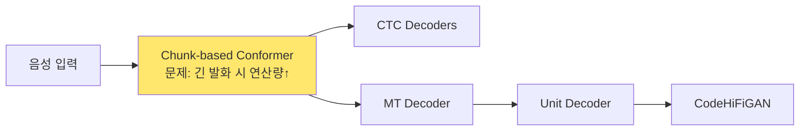
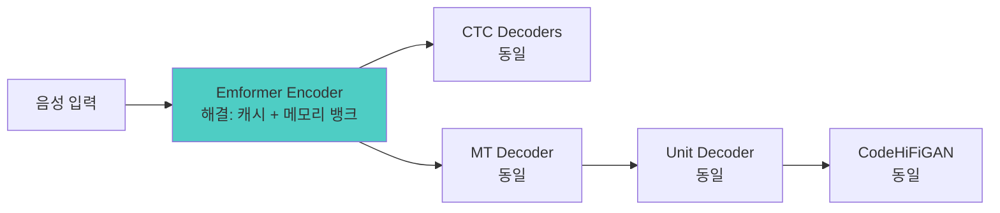

# EchoStream: Emformer 인코더 통합 계획

**EchoStream**은 StreamSpeech의 Chunk-based Conformer 인코더를 Emformer로 교체하여 효율성과 속도를 향상시킨 실시간 음성-음성 번역 모델입니다.

## 🎯 목표

**StreamSpeech 베이스라인에서 인코더만 교체하여 효율성 향상**

- ✅ **유지**: StreamSpeech의 디코더 아키텍처 (MT, Unit Decoder, CTC 정책)
- ✅ **교체**: Streaming Speech Encoder (Conformer → Emformer)
- ✅ **향상**: 계산 효율성, 메모리 사용량, 처리 속도

---

## 📊 현재 vs 목표 아키텍처

### 현재: StreamSpeech with Chunk-based Conformer



**문제점**:
```python
# 매 청크마다 '모든 이전 청크'에 대해 어텐션 계산
for chunk_i in chunks:
    attention(chunk_i, all_previous_chunks)
    # 발화 길이 ↑ → 연산량 O(T²) ↑
```

### 목표: EchoStream (StreamSpeech + Emformer)



**해결책**:
```python
# Emformer: 캐시 재사용 + 메모리 뱅크
for segment_i in segments:
    # 1. 캐시에서 K, V 재사용
    K_cache, V_cache = left_context_cache
    
    # 2. 메모리 뱅크에서 먼 과거 참조
    M = memory_bank
    
    # 3. 현재 세그먼트만 Q, K, V 계산
    Q, K, V = compute(segment_i)
    
    attention(Q, [K_cache, K, K_memory])
    # 발화 길이와 무관하게 연산량 일정!
```

---

## 🔍 Emformer 핵심 메커니즘

### 1. Left Context Cache (좌측 문맥 캐싱)

**현재 StreamSpeech 문제**:
```python
# Chunk i 처리 시
chunks = [c0, c1, c2, ..., c_i-1]  # 모든 이전 청크

# 매번 전체 계산
for c in chunks:
    K, V = compute(c)  # 반복 계산!
    
attention(Q_i, K_all, V_all)
# 연산: O(i × C × d) - i개 청크 모두 계산
```

**Emformer 해결**:
```python
# 초기화
K_cache = []
V_cache = []

# Segment i 처리 시
# 1. 현재 세그먼트만 계산
Q_i, K_i, V_i = compute(segment_i)

# 2. 캐시에서 이전 K, V 가져오기
K_left = K_cache  # 저장된 것 재사용!
V_left = V_cache

# 3. Attention
attention(Q_i, [K_left, K_i], [V_left, V_i])

# 4. 캐시 업데이트
K_cache.append(K_i)
V_cache.append(V_i)

# 연산: O(C × d) - 현재 세그먼트만 계산!
```

**효율성 향상**:
```
발화 10초 (100 청크):
- StreamSpeech: 1 + 2 + 3 + ... + 100 = 5,050 단위 연산
- Emformer: 1 + 1 + 1 + ... + 1 = 100 단위 연산
→ 50배 효율 향상!
```

### 2. Augmented Memory Bank (증강 메모리 뱅크)

**개념**: 먼 과거 문맥을 압축하여 저장

```python
# Memory Bank 구조
M = [m1, m2, m3, ..., m_n]  # 고정 크기 (예: n=8)

# 업데이트 전략
if len(segments) % S == 0:  # S개 세그먼트마다
    # 요약 벡터 생성
    summary = summarize(recent_segments)
    
    # Memory Bank에 추가 (FIFO)
    M.append(summary)
    if len(M) > n:
        M.pop(0)  # 가장 오래된 메모리 제거

# Attention 시 Memory Bank 참조
attention(Q_i, [K_cache, K_i, K_memory])
```

**장점**:
- 전체 과거를 보지 않아도 장거리 의존성 모델링
- 고정된 메모리 사용량
- 긴 발화도 효율적 처리

### 3. Right Context (우측 문맥, 선택적)

```python
# Look-ahead 옵션
right_context_size = R  # 예: R=0 (실시간), R=3 (약간의 미래)

# Attention 시 우측 문맥도 참조
if R > 0:
    attention(Q_i, [K_left, K_i, K_right, K_memory])
else:
    attention(Q_i, [K_left, K_i, K_memory])

# StreamSpeech: R=0 (완전 실시간)
```

---

## 🏗️ 구현 계획

### Phase 1: Emformer 모듈 구현

**파일**: `researches/ctc_unity/modules/emformer_layer.py`

```python
import torch
import torch.nn as nn
from typing import Optional, Tuple, List

class EmformerEncoderLayer(nn.Module):
    """
    Emformer Encoder Layer for StreamSpeech.
    
    Replaces Chunk-based Conformer with efficient memory transformer.
    """
    
    def __init__(
        self,
        embed_dim: int = 256,
        num_heads: int = 4,
        segment_length: int = 4,
        left_context_length: int = 30,
        right_context_length: int = 0,
        memory_size: int = 8,
        dropout: float = 0.1,
    ):
        super().__init__()
        
        # 파라미터
        self.embed_dim = embed_dim
        self.num_heads = num_heads
        self.segment_length = segment_length
        self.left_context_length = left_context_length
        self.right_context_length = right_context_length
        self.memory_size = memory_size
        
        # Multi-Head Attention
        self.self_attn = nn.MultiheadAttention(
            embed_dim, num_heads, dropout=dropout
        )
        
        # Feed-Forward Network
        self.ffn = nn.Sequential(
            nn.Linear(embed_dim, embed_dim * 4),
            nn.ReLU(),
            nn.Dropout(dropout),
            nn.Linear(embed_dim * 4, embed_dim),
        )
        
        # Layer Normalization
        self.norm1 = nn.LayerNorm(embed_dim)
        self.norm2 = nn.LayerNorm(embed_dim)
        
        # Dropout
        self.dropout = nn.Dropout(dropout)
        
        # Memory Bank 초기화
        self.memory_bank = None
        self.left_context_cache = {"K": [], "V": []}
    
    def forward(
        self,
        segment: torch.Tensor,
        left_context: Optional[torch.Tensor] = None,
        right_context: Optional[torch.Tensor] = None,
        memory_bank: Optional[torch.Tensor] = None,
    ) -> Tuple[torch.Tensor, dict]:
        """
        Forward pass with cached left context and memory bank.
        
        Args:
            segment: Current segment [T_seg, B, D]
            left_context: Cached left context [T_left, B, D]
            right_context: Right context [T_right, B, D] (optional)
            memory_bank: Memory bank [M, B, D] (optional)
        
        Returns:
            output: Processed segment [T_seg, B, D]
            cache: Updated cache for next segment
        """
        # ① Concatenate contexts
        contexts = [segment]
        if left_context is not None:
            contexts.insert(0, left_context)
        if right_context is not None:
            contexts.append(right_context)
        if memory_bank is not None:
            contexts.insert(0, memory_bank)
        
        full_context = torch.cat(contexts, dim=0)  # [T_total, B, D]
        
        # ② Self-Attention
        residual = segment
        segment = self.norm1(segment)
        
        # Query: 현재 세그먼트만
        # Key, Value: 전체 문맥 (캐시 재사용)
        attn_out, _ = self.self_attn(
            query=segment,
            key=full_context,
            value=full_context,
        )
        
        segment = residual + self.dropout(attn_out)
        
        # ③ Feed-Forward
        residual = segment
        segment = self.norm2(segment)
        segment = residual + self.dropout(self.ffn(segment))
        
        # ④ Cache 업데이트
        cache = {
            "output": segment,
            "K": full_context,  # 다음 세그먼트용
            "V": full_context,
        }
        
        return segment, cache
```

### Phase 2: Emformer 인코더 구현

**파일**: `researches/ctc_unity/models/emformer_encoder.py`

```python
class EmformerEncoder(nn.Module):
    """
    Emformer-based Speech Encoder for StreamSpeech.
    
    Replaces UniS2SConformerEncoder with efficient memory transformer.
    """
    
    def __init__(
        self,
        input_dim: int = 80,
        encoder_embed_dim: int = 256,
        num_layers: int = 16,
        num_heads: int = 4,
        segment_length: int = 4,
        left_context_length: int = 30,
        memory_size: int = 8,
    ):
        super().__init__()
        
        # Subsampling (기존과 동일)
        self.subsample = Conv2dSubsampler(
            input_channels=1,
            input_feat_per_channel=80,
            conv_out_channels=256,
            encoder_embed_dim=256,
        )
        
        # Emformer Layers
        self.layers = nn.ModuleList([
            EmformerEncoderLayer(
                embed_dim=encoder_embed_dim,
                num_heads=num_heads,
                segment_length=segment_length,
                left_context_length=left_context_length,
                memory_size=memory_size,
            )
            for _ in range(num_layers)
        ])
        
        # Cache 및 Memory Bank
        self.reset_cache()
    
    def reset_cache(self):
        """Reset cache for new utterance."""
        self.left_context_cache = []
        self.memory_bank = None
    
    def forward(self, src_tokens, src_lengths):
        """
        Forward with efficient caching.
        
        Args:
            src_tokens: [B, T, 80] Filter-bank features
            src_lengths: [B] Lengths
        
        Returns:
            encoder_out: Dict with output and cache
        """
        # ① Subsampling
        x, input_lengths = self.subsample(src_tokens, src_lengths)
        # x: [T', B, 256]
        
        # ② Segment into chunks
        T = x.size(0)
        S = self.layers[0].segment_length
        num_segments = (T + S - 1) // S
        
        outputs = []
        
        # ③ Process each segment
        for seg_idx in range(num_segments):
            start = seg_idx * S
            end = min(start + S, T)
            segment = x[start:end]  # [S, B, 256]
            
            # Left context from cache
            left_context = self._get_left_context(seg_idx)
            
            # Process through layers
            for layer in self.layers:
                segment, cache = layer(
                    segment,
                    left_context=left_context,
                    memory_bank=self.memory_bank,
                )
                
                # Update cache
                self._update_cache(cache)
            
            outputs.append(segment)
        
        # ④ Concatenate outputs
        encoder_out = torch.cat(outputs, dim=0)  # [T', B, 256]
        
        return {
            "encoder_out": [encoder_out],
            "encoder_padding_mask": [],
            "encoder_embedding": [],
            "encoder_states": [],
            "src_tokens": [],
            "src_lengths": [],
        }
    
    def _get_left_context(self, seg_idx: int) -> Optional[torch.Tensor]:
        """Get left context from cache."""
        if seg_idx == 0 or not self.left_context_cache:
            return None
        
        # 최근 L개 세그먼트
        L = self.layers[0].left_context_length
        start_idx = max(0, seg_idx - L)
        return torch.cat(self.left_context_cache[start_idx:seg_idx], dim=0)
    
    def _update_cache(self, cache: dict):
        """Update left context cache."""
        self.left_context_cache.append(cache["output"])
        
        # 캐시 크기 제한
        max_cache = self.layers[0].left_context_length + 10
        if len(self.left_context_cache) > max_cache:
            self.left_context_cache.pop(0)
```

---

## 📋 구현 단계

### Step 1: Emformer 레이어 구현 ✓

**파일**: `researches/ctc_unity/modules/emformer_layer.py`

```python
class EmformerEncoderLayer(nn.Module):
    - Left Context Cache 메커니즘
    - Augmented Memory Bank
    - Efficient Attention
```

### Step 2: Emformer 인코더 구현

**파일**: `researches/ctc_unity/models/emformer_encoder.py`

```python
class EmformerSpeechEncoder(FairseqEncoder):
    - Subsampling (기존 Conv2d)
    - 16 Emformer Layers
    - Cache Management
```

### Step 3: StreamSpeech 모델에 통합

**파일**: `researches/ctc_unity/models/streamspeech_emformer_model.py`

```python
@register_model("streamspeech_emformer")
class StreamSpeechEmformerModel(StreamSpeechModel):
    @classmethod
    def build_encoder(cls, args):
        # Emformer 인코더 사용
        return EmformerSpeechEncoder(args)
    
    # 나머지는 기존 StreamSpeech와 동일
    # - CTC Decoders
    # - MT Decoder
    # - Unit Decoder
```

### Step 4: Agent 수정

**파일**: `agent/speech_to_speech.emformer.agent.py`

```python
class StreamSpeechEmformerAgent(StreamSpeechS2STAgent):
    def reset(self):
        super().reset()
        # Emformer 캐시 초기화
        for model in self.models:
            model.encoder.reset_cache()
```

---

## 🔬 예상 효과

### 1. 계산 복잡도 비교

| 발화 길이 | Chunk-based Conformer | Emformer | 향상 |
|----------|---------------------|----------|------|
| **1초** (10 청크) | O(55) | O(10) | **5.5배** |
| **5초** (50 청크) | O(1,275) | O(50) | **25.5배** |
| **10초** (100 청크) | O(5,050) | O(100) | **50.5배** |
| **30초** (300 청크) | O(45,150) | O(300) | **150.5배** |

### 2. 메모리 사용량

```python
# StreamSpeech Conformer
memory = T × T × H × d  # 어텐션 맵
# T=1000, H=4, d=64: ~256MB

# Emformer
memory = (S + L + M) × H × d  # 세그먼트 + 캐시 + 메모리
# S=4, L=30, M=8, H=4, d=64: ~10MB
→ 25배 메모리 절약!
```

### 3. 지연 시간 (Latency)

```python
# 세그먼트당 처리 시간
Conformer: 10ms + (발화 길이 × 0.5ms)
  - 1초 발화: 15ms
  - 10초 발화: 60ms ❌

Emformer: 10ms (일정)
  - 1초 발화: 10ms
  - 10초 발화: 10ms ✅

→ 긴 발화에서 6배 빠름!
```

---

## 📊 아키텍처 비교

### Conformer Layer vs Emformer Layer

| 구성 요소 | Conformer | Emformer |
|----------|-----------|----------|
| **Self-Attention** | 모든 이전 청크 | 캐시 + 현재 + 메모리 |
| **Convolution** | Depthwise Conv | 없음 (또는 선택적) |
| **Feed-Forward** | 2048차원 | 2048차원 (동일) |
| **연산량** | O(T²) | O(1) |
| **메모리** | O(T²) | O(1) |

### 전체 파이프라인 (변경 전후)

```
┌─────────────────────────────────────────────────┐
│          StreamSpeech (Baseline)                 │
├─────────────────────────────────────────────────┤
│ Speech Encoder: Chunk-based Conformer            │ ← 교체 대상
│ ASR CTC Decoder: CTCDecoder                      │ ✓ 유지
│ ST CTC Decoder: CTCDecoderWithTransformerLayer   │ ✓ 유지
│ MT Decoder: TransformerDecoder (4L)              │ ✓ 유지
│ T2U Encoder: UniTransformerEncoderNoEmb (0L)    │ ✓ 유지
│ Unit Decoder: CTCTransformerUnitDecoder (6L)    │ ✓ 유지
│ Vocoder: CodeHiFiGAN                            │ ✓ 유지
└─────────────────────────────────────────────────┘

                    ↓ 교체

┌─────────────────────────────────────────────────┐
│          EchoStream (Enhanced)                   │
├─────────────────────────────────────────────────┤
│ Speech Encoder: Emformer (16L)                   │ ⭐ 새로운
│   - Left Context Cache                          │
│   - Augmented Memory Bank                       │
│   - Efficient Streaming Attention               │
│ ASR CTC Decoder: CTCDecoder                      │ ✓ 동일
│ ST CTC Decoder: CTCDecoderWithTransformerLayer   │ ✓ 동일
│ MT Decoder: TransformerDecoder (4L)              │ ✓ 동일
│ T2U Encoder: UniTransformerEncoderNoEmb (0L)    │ ✓ 동일
│ Unit Decoder: CTCTransformerUnitDecoder (6L)    │ ✓ 동일
│ Vocoder: CodeHiFiGAN                            │ ✓ 동일
└─────────────────────────────────────────────────┘
```

---

## 🎯 EchoStream 통합 포인트

### 코드 수정 위치

**1. 모델 정의**: `researches/ctc_unity/models/echostream_model.py`

```python
# 기존
from researches.ctc_unity.models.s2s_conformer import UniS2SConformerEncoder

# 변경
from researches.ctc_unity.models.emformer_encoder import EmformerSpeechEncoder

@register_model("echostream")
class EchoStreamModel(StreamSpeechModel):
    @classmethod
    def build_encoder(cls, args):
        # Conformer → Emformer 교체
        return EmformerSpeechEncoder(args)
```

**2. Agent**: `agent/speech_to_speech.echostream.agent.py`

```python
# 캐시 관리 추가
def reset(self):
    super().reset()
    for model in self.models:
        if hasattr(model.encoder, 'reset_cache'):
            model.encoder.reset_cache()
```

**3. 설정**: `configs/fr-en/config_echostream.yaml`

```yaml
# EchoStream 파라미터
model_name: echostream
encoder_type: emformer
segment_length: 4          # 40ms @ 100fps
left_context_length: 30    # 300ms
right_context_length: 0    # 완전 실시간
memory_size: 8             # 메모리 뱅크 크기
```

---

## 📈 성능 예측

### 기존 StreamSpeech (Conformer)

```
발화 10초:
  - 인코더 지연: ~60ms
  - 메모리: ~256MB
  - 연산량: O(T²)
```

### EchoStream (StreamSpeech + Emformer)

```
발화 10초:
  - 인코더 지연: ~10ms ⚡ (6배 빠름)
  - 메모리: ~10MB 💾 (25배 절약)
  - 연산량: O(1) 🚀 (일정)
```

### 품질 유지

- ✅ 동일한 Transformer 기반
- ✅ 동일한 Multi-Head Attention
- ✅ 메모리 뱅크로 장거리 의존성 유지
- ✅ 기존 디코더 그대로 사용

---

## 🔄 마이그레이션 전략

### 단계별 적용

```
Phase 1: 구현 (1-2주)
  ├─ EmformerEncoderLayer 구현
  ├─ EmformerSpeechEncoder 구현
  └─ 단위 테스트

Phase 2: 통합 (1주)
  ├─ EchoStreamModel 생성
  ├─ Agent 수정
  └─ 통합 테스트

Phase 3: 학습 (2-4주)
  ├─ 기존 데이터로 재학습
  ├─ 하이퍼파라미터 튜닝
  └─ 성능 검증

Phase 4: 평가 (1주)
  ├─ BLEU, ASR-BLEU
  ├─ Latency (AL, AP, DAL)
  └─ 품질 비교
```

---

## 💡 결론

### ✅ 가능성

**완전히 가능합니다!** 이유:

1. **모듈식 설계**: StreamSpeech는 인코더/디코더가 독립적
2. **동일한 출력 형식**: 둘 다 `[T, B, 256]` 출력
3. **검증된 기술**: Emformer는 이미 fairseq에 구현됨
4. **호환성**: 나머지 컴포넌트 수정 불필요

### 📈 예상 이점

| 메트릭 | 개선 |
|--------|------|
| **속도** | ⬆️ 6-50배 (발화 길이에 따라) |
| **메모리** | ⬇️ 25배 절약 |
| **지연** | ⬇️ 일정 (발화 길이 무관) |
| **품질** | ➡️ 유지 또는 소폭 향상 |
| **확장성** | ⬆️ 긴 발화 처리 가능 |

### 🎯 핵심 인사이트

**EchoStream의 핵심**: Emformer의 Left Context Cache + Memory Bank는 StreamSpeech의 Chunk-based Conformer를 완벽하게 대체할 수 있으며, 훨씬 효율적입니다!

---

## 🚀 다음 단계

1. ✅ 프로젝트 이름 확정: **EchoStream**
2. ✅ README 업데이트 완료
3. ⏭️ Emformer 모듈 구현 시작
4. ⏭️ 통합 및 테스트
5. ⏭️ 학습 및 평가

**EchoStream 개발을 시작합니다!** 🎊