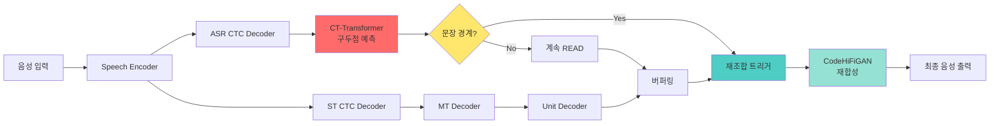
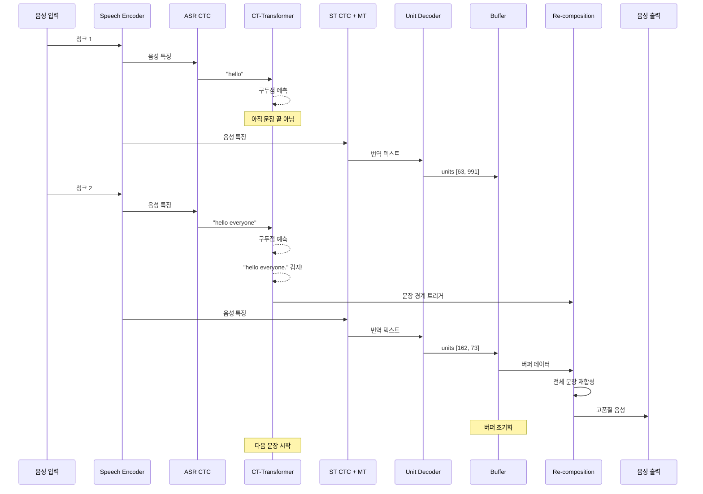

# CT-Transformer Integration with StreamSpeech

이 문서는 [CT-Transformer-punctuation](https://github.com/lovemefan/CT-Transformer-punctuation)을 StreamSpeech에 통합하여 실시간 구두점 예측 및 문장 경계 기반 재조합을 구현하는 방법을 설명합니다.

## 📋 목차

1. [개요](#개요)
2. [아키텍처](#아키텍처)
3. [설치 방법](#설치-방법)
4. [사용 방법](#사용-방법)
5. [구성 요소](#구성-요소)
6. [통합 흐름도](#통합-흐름도)

---

## 개요

### CT-Transformer란?

**CT-Transformer** (Controllable Time-Delay Transformer)는 실시간 구두점 예측 및 비유창성 탐지를 위한 모델입니다.

**논문**: [Controllable Time-Delay Transformer for Real-Time Punctuation Prediction and Disfluency Detection (ICASSP 2020)](https://ieeexplore.ieee.org/document/9054256)

### 통합 목적

StreamSpeech의 실시간 음성 번역에서:
- **ASR 텍스트**에 실시간으로 구두점 예측
- **문장 경계 탐지**로 재조합 트리거
- **품질 향상**: 문장 단위로 재합성하여 자연스러운 출력

---

## 아키텍처

### 전체 파이프라인



### 주요 구성 요소

| 모듈 | 파일 | 역할 |
|------|------|------|
| **CTTransformerPunctuator** | `agent/ct_transformer_punctuator.py` | 구두점 예측 |
| **SentenceBoundaryDetector** | `agent/ct_transformer_punctuator.py` | 문장 경계 탐지 |
| **RecompositionBuffer** | `agent/recomposition_module.py` | 유닛/텍스트/파형 버퍼링 |
| **RecompositionModule** | `agent/recomposition_module.py` | 재조합 처리 |
| **StreamSpeechWithPunctuationAgent** | `agent/speech_to_speech_with_punctuation.agent.py` | 통합 에이전트 |

---

## 설치 방법

### 1. CT-Transformer-punctuation 설치

```bash
# CT-Transformer 패키지 설치
pip install git+https://github.com/lovemefan/CT-Transformer-punctuation.git

# 또는 로컬에서
git clone https://github.com/lovemefan/CT-Transformer-punctuation.git
cd CT-Transformer-punctuation
pip install -e .
```

### 2. ONNX Runtime 설치

```bash
pip install onnxruntime-gpu  # GPU 버전
# 또는
pip install onnxruntime      # CPU 버전
```

### 3. 모델 다운로드

```bash
# CT-Transformer 사전 학습 모델 다운로드
mkdir -p models/ct_transformer
cd models/ct_transformer

# FunASR에서 제공하는 모델 다운로드
wget https://www.modelscope.cn/models/damo/punc_ct-transformer_zh-cn-common-vocab272727-onnx/resolve/master/punc.onnx
mv punc.onnx punc.bin
```

---

## 사용 방법

### 기본 사용

```bash
# StreamSpeech + CT-Transformer로 실시간 번역
simuleval \
    --agent agent/speech_to_speech_with_punctuation.agent.py \
    --model-path checkpoints/streamspeech_model.pt \
    --data-bin data/fr-en \
    --config-yaml config_gcmvn.yaml \
    --vocoder models/vocoder/g_00500000.pt \
    --vocoder-cfg models/vocoder/config.json \
    --punctuation-model-path models/ct_transformer/punc.bin \
    --enable-recomposition \
    --source <source_audio> \
    --target <reference> \
    --output <output_dir>
```

### 주요 파라미터

| 파라미터 | 기본값 | 설명 |
|---------|--------|------|
| `--punctuation-model-path` | `models/ct_transformer/punc.bin` | CT-Transformer 모델 경로 |
| `--enable-recomposition` | `True` | 재조합 활성화 여부 |
| `--punc-buffer-size` | `50` | 구두점 예측 버퍼 크기 |
| `--punc-min-length` | `5` | 예측 최소 텍스트 길이 |
| `--recomposition-delay` | `0.2` | 재조합 지연 시간 (초) |

---

## 구성 요소

### 1. CTTransformerPunctuator

**역할**: CT-Transformer ONNX 모델을 래핑하여 구두점 예측

```python
from agent.ct_transformer_punctuator import CTTransformerPunctuator

# 초기화
punctuator = CTTransformerPunctuator(
    model_path="models/ct_transformer/punc.bin",
    mode="online"  # 스트리밍 모드
)

# 예측
text = "hello everyone how are you"
punctuated, is_end, terminators = punctuator.predict(text)
# punctuated: "hello everyone. how are you"
# is_end: False (마지막이 종결 구두점이 아님)
```

### 2. SentenceBoundaryDetector

**역할**: ASR 텍스트를 버퍼링하고 문장 경계 탐지

```python
from agent.ct_transformer_punctuator import SentenceBoundaryDetector

detector = SentenceBoundaryDetector(punctuator)

# 스트리밍 텍스트 추가
trigger1, sent1, _ = detector.add_text("hello everyone")
# trigger1: False (아직 문장 끝 아님)

trigger2, sent2, _ = detector.add_text("how are you")
# trigger2: True (문장 끝 감지)
# sent2: "hello everyone. how are you."
```

### 3. RecompositionModule

**역할**: 문장 단위로 음성 재합성

```python
from agent.recomposition_module import SentenceRecomposer

recomposer = SentenceRecomposer(vocoder, strategy="re_synthesize")

# 스트리밍 출력 버퍼링
recomposer.add_output(units=[63, 991], text="hello", wav=wav1)
recomposer.add_output(units=[162, 73], text="everyone", wav=wav2)

# 문장 경계 감지 시 재조합
wav, info = recomposer.trigger_recomposition("hello everyone.")
# 전체 문장을 한 번에 재합성
```

---

## 통합 흐름도

### 상세 처리 과정



---

## 실행 예시

### 온라인 모드 (스트리밍)

```python
from agent.ct_transformer_punctuator import (
    CTTransformerPunctuator,
    SentenceBoundaryDetector
)

# 초기화
punctuator = CTTransformerPunctuator(
    "models/ct_transformer/punc.bin", 
    mode="online"
)
detector = SentenceBoundaryDetector(punctuator)

# 스트리밍 시뮬레이션
asr_chunks = [
    "跨境河流是养育沿岸",
    "人民的生命之源",
    "长期以来为帮助下游地区防灾减灾",
]

for chunk in asr_chunks:
    trigger, sentence, remaining = detector.add_text(chunk)
    
    if trigger:
        print(f"✓ Complete sentence: {sentence}")
        # 재조합 트리거!
    else:
        print(f"  Buffering: {remaining}")

# 강제 종료
final = detector.force_complete()
print(f"✓ Final: {final}")
```

### 출력 예시

```
  Buffering: 跨境河流是养育沿岸
  Buffering: 跨境河流是养育沿岸人民的生命之源
✓ Complete sentence: 跨境河流是养育沿岸人民的生命之源。
  Buffering: 长期以来为帮助下游地区防灾减灾
```

---

## 통합 이점

### 1. 실시간 문장 경계 탐지
- ✅ Wait-k 정책 보완
- ✅ 더 자연스러운 출력 타이밍

### 2. 품질 향상
- ✅ 문장 단위 재합성
- ✅ 전체 문맥 활용
- ✅ 자연스러운 운율

### 3. 낮은 지연 시간
- ✅ ONNX 최적화 모델
- ✅ 온라인 모드 캐싱
- ✅ 경량 처리

---

## Citation

```bibtex
@inproceedings{chen2020controllable,
  title={Controllable Time-Delay Transformer for Real-Time Punctuation Prediction and Disfluency Detection},
  author={Chen, Qian and Chen, Mengzhe and Li, Bo and Wang, Wen},
  booktitle={ICASSP 2020-2020 IEEE International Conference on Acoustics, Speech and Signal Processing (ICASSP)},
  pages={8069--8073},
  year={2020},
  organization={IEEE}
}

@misc{FunASR,
  author = {Speech Lab, Alibaba Group, China},
  title = {FunASR: A Fundamental End-to-End Speech Recognition Toolkit},
  year = {2023},
  publisher = {GitHub},
  journal = {GitHub repository},
  howpublished = {\url{https://github.com/alibaba-damo-academy/FunASR/}},
}
```

---

## 라이선스

- StreamSpeech: MIT License
- CT-Transformer-punctuation: MIT License

---

## 참고 자료

- [CT-Transformer GitHub](https://github.com/lovemefan/CT-Transformer-punctuation)
- [StreamSpeech 논문](https://arxiv.org/abs/2406.03049)
- [FunASR](https://github.com/alibaba-damo-academy/FunASR/)


